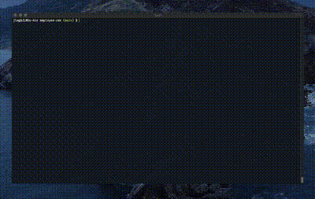

# Employee Management CMS CLI

## Table of Contents

- [Installation](#installation)
- [Usage](#usage)
- [Credits](#credits)
- [License](#license)
- [Contributing](#contributing)
- [Tests](#tests)

## Description

A simple CLI employee management system.

## Installation

1. Clone the repo.
2. Run the `schema.sql` and `seed.sql` in MySQL Workbench (or your favorite SQL application) to create and seed a local database. _**Note:** This is required for the application to run._
3. `cd` into the project folder.
4. Run `npm install`.
5. Run `node server.js` to run the program.

## Usage

Once installed, run `node server.js` to run the program.

### Demo

## Credits

The following packages and their accompanying documentation is used extensively for this project:

- [mysql](https://www.npmjs.com/package/mysql)
- [console-table](https://www.npmjs.com/package/console.table)
- [Inquirer](https://www.npmjs.com/package/inquirer)
- [Jest](https://jestjs.io/)
- [ASCII-art Logo](https://www.npmjs.com/package/asciiart-logo)

## License

Licensed under the MIT license.

## Contributing

Contributions are welcome. If you are interested in contributing to this project, please open a pull request. Bug fixes, feature requests, and documentation updates/fixes are all encouraged.

## Tests

Run `npm run test` to run tests located in the 'tests' directory.

## Questions?

Please contact me via email at goul0076@gmail.com with any questions.
